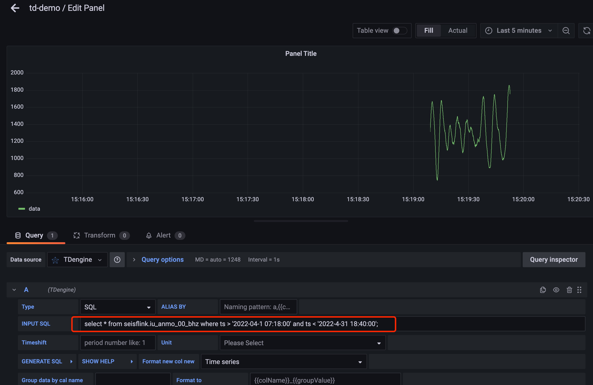

# TDengine Open Data Set Project - U.S. 

**欢迎来到 TDengine 开放数据服务中心！**


该网站是一个开放数据集，从国内数据中心数据实时获取，您可以很方便从这里获取数据并使用它，用于科学研究、算法分析等。

**已支持数据集**

[地震](test)

[电量](test)

[气象](test)

[科学](test)


# 常见问题?

请移至[常见问题](test)。 或者在 [Github](test) 上提出 issue。 如果您遇到困难或其它疑问🤔️，可以发送[电子邮件](test)联系我们。

# 互动和支持

您可以加入微信讨论群和其它用户一起讨论

[微信群](test) 


## IRIS 地震波形数据

数据源：[http://rtserve.iris.washington.edu:18000](http://rtserve.iris.washington.edu:18000/)

从 IRIS DMC (数据管理中心)  实时获取 MiniSeed 格式地震数据，并使用 ObsPy 将 MiniSeed 数据解包成采样点后按照时间序列存入TDengine。您可以很容易的使用该数据进行相关算法验证，也可以将元数据和采样数据还原成MiniSeed包，供地震专业分析软件使用。

地震计的数据包经过解包后把采样点数据按照时间顺序存入该表中，如下：
```
taos> select * from iu_anmo_00_bhz limit 10;
           ts            |    data     |
========================================
 2022-03-30 15:49:24.019 |        1563 |
 2022-03-30 15:49:24.044 |        1546 |
 2022-03-30 15:49:24.069 |        1542 |
 2022-03-30 15:49:24.094 |        1532 |
 2022-03-30 15:49:24.119 |        1519 |
 2022-03-30 15:49:24.144 |        1518 |
 2022-03-30 15:49:24.169 |        1515 |
 2022-03-30 15:49:24.194 |        1510 |
 2022-03-30 15:49:24.219 |        1500 |
 2022-03-30 15:49:24.244 |        1498 |
Query OK, 10 row(s) in set (0.001422s)
```

## 数据对应的表结构说明
相关名词概念参见[建表说明](https://www.taosdata.com/docs/cn/v2.0/model#-1)。

**数据库名**： seisflink

**超级表**:  
```
taos> create table seismometer (ts TIMESTAMP, data INT) TAGS(net BINARY(20), sta BINARY(20), loc BINARY(20), chn BINARY(20) );

taos> desc seismometer;
             Field              |         Type         |   Length    |   Note   |
=================================================================================
 ts                             | TIMESTAMP            |           8 |          |
 data                           | INT                  |           4 |          |
 net                            | BINARY               |          20 | TAG      |
 sta                            | BINARY               |          20 | TAG      |
 loc                            | BINARY               |          20 | TAG      |
 chn                            | BINARY               |          20 | TAG      |
Query OK, 6 row(s) in set (0.000142s)

```
设计两个字段以及4个标签，ts为采样时间，value为采样值，四个tags分别为地震计对应的台网、台站、通道和位置号

tags ： 台网名(net)、台站名(sta)、位置号(loc)、通道号(chn)

列字段：ts (时间戳)，data（采样点值）

子表： 每一个台站对应一张子表，如 seisflink.iu_anmo_00_bhz。子表表结构设计同超级表。

## 数据获取方式示例(Python)：

### 安装连接器

[TDengine python 连接器安装指南](https://www.taosdata.com/docs/cn/v2.0/connector#python) 。

### 使用注册的用户名，密码连接到 TDengine 服务器

**注意**：请在自己的代码中使用自己注册的用户名，密码。

```
# -*- coding: utf-8 -*-                                                                                                        
# 连接 TDengine 服务器示例
import taos                                                                                                                    
                                                                                                                               
conn = taos.connect(host='127.0.0.1', user='root', password='taosdata', database='seisflink')                                  
cursor = conn.cursor()                                                                                                         
# 列出并打印数据库信息                                                                                                         
cursor.execute("show databases")                                                                                               
results = cursor.fetchall()                                                                                                    
for row in results:                                                                                                            
    print(row)
```
执行示例：
```
ubuntu@u0-96:~/work/github/seedlink2taos_py/q1$ python3 taosConn.py 
('log', datetime.datetime(2022, 3, 30, 12, 11, 33, 543000), 21, 1, 1, 1, 10, '30', 1, 3, 100, 4096, 1, 3000, 2, 0, 'us', 0, 'ready')
('seisflink', datetime.datetime(2022, 3, 30, 15, 49, 47, 193000), 5, 1, 1, 1, 10, '3650', 16, 6, 100, 4096, 1, 3000, 2, 0, 'ms', 0, 'ready')
```

### fetch 数据

```
# -*- coding: utf-8 -*-                                                                                                        
# 连接 TDengine 服务器示例
import taos                                                                                                                    
                                                                                                                               
conn = taos.connect(host='127.0.0.1', user='root', password='taosdata', database='seisflink')                                  
cursor = conn.cursor()                                                                                                         

result = conn.query("select * from seisflink.iu_anmo_00_bhz limit 10")
num_of_fields = result.field_count
# 输出字段信息
for field in result.fields:
    print(field)
# 输出每一行到值
for row in result:
    print(row)
```
执行示例：
```
$ python3 taosFetch.py 
{name: ts, type: 9, bytes: 8}
{name: data, type: 4, bytes: 4}
(datetime.datetime(2022, 3, 30, 15, 49, 24, 19000), 1563)
(datetime.datetime(2022, 3, 30, 15, 49, 24, 44000), 1546)
(datetime.datetime(2022, 3, 30, 15, 49, 24, 69000), 1542)
(datetime.datetime(2022, 3, 30, 15, 49, 24, 94000), 1532)
(datetime.datetime(2022, 3, 30, 15, 49, 24, 119000), 1519)
(datetime.datetime(2022, 3, 30, 15, 49, 24, 144000), 1518)
(datetime.datetime(2022, 3, 30, 15, 49, 24, 169000), 1515)
(datetime.datetime(2022, 3, 30, 15, 49, 24, 194000), 1510)
(datetime.datetime(2022, 3, 30, 15, 49, 24, 219000), 1500)
(datetime.datetime(2022, 3, 30, 15, 49, 24, 244000), 1498)
```

## 简单 dashboard 展示

这里我们用 grafana 连接到 TDengine 服务器进行波形展示，具体方式见 [grafana 配置说明](https://www.taosdata.com/docs/cn/v2.0/connections#)
 


